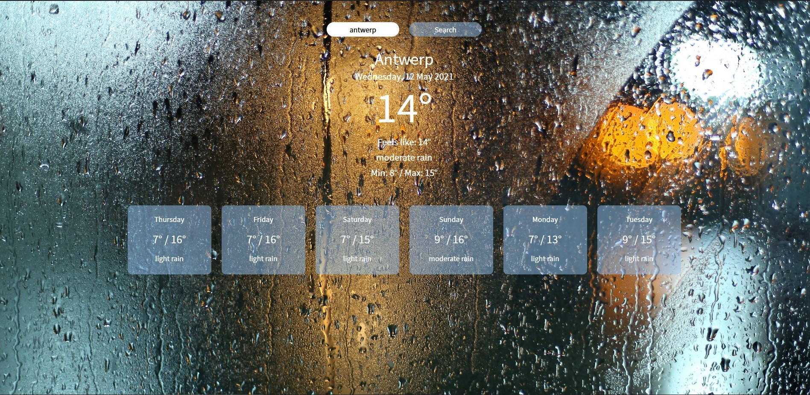

## Personal notes about this project:

Making a functional weather app:
* Training skills in using fetch API and Async/Await
* Using JS to manipulate and put elements in DOM
* Trying to make it attractive and user-friendly 
* Learning how to KISS and keep it more structured

* Added background images that change according to the current weather type
* Almost all elements in HTML are created through Javascript
* App is made responsive with Bootstrap

check out the finished weather app here: https://mickdellaert.github.io/weather-app/

# The weather application

## Practical Information

* Repository: `ajax-weather-api`
* Deadline: 2 days
* Delivery: Github page (published)
* Team: Solo

## Learning Objectives

* A typical AJAX flow: send asynchronous requests to a remote server and process the results;
* DOM manipulation: changing the DOM based on results of AJAX-requests.
* Learn to aggregate data fetched from an api

## Exercise

### Sprint 1

- create an account on this [platform](https://home.openweathermap.org/.)
- You are going to have to generate a key.
- create a home page where you ask the visitor to enter the city of his choice.

### Sprint 2

- Get the weather data using [axios](https://github.com/axios/axios) or another javascript AJAX enabled library or use the native JS fetch() method
- Optional: Use a cdn link to link axios to your project.
- Display the weather for the next 5 days. Show the averages per day.
- Apply styling to your project using media queries to make it responsive.

## Extra challenges

- Use the API of https://unsplash.com/ to show a photo of the city they entered in the form.
- Use a graph library like Google Graphs to show a line graph of the temperature over time.
# weather-app
